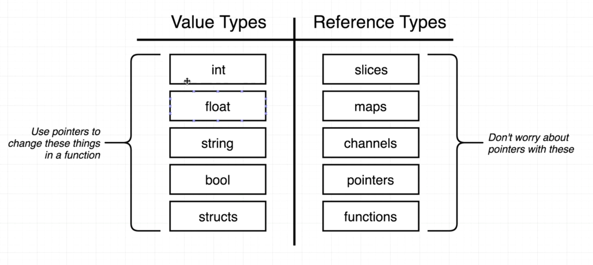

# go-lang

go

1. Go is pass-by-value : makes "copies" of values when passed into functions

2. Variables declared without a corresponding initialization are zero-valued

3. Variable types
   

4. For structs, pointers are automatically de-referenced

5. Whenever a method is called to update value - pass a pointer

### Commands

1. go mod init {name}

2. go mod tidy

### References

1. https://neilalexander.dev/2021/08/29/go-pass-by-value
